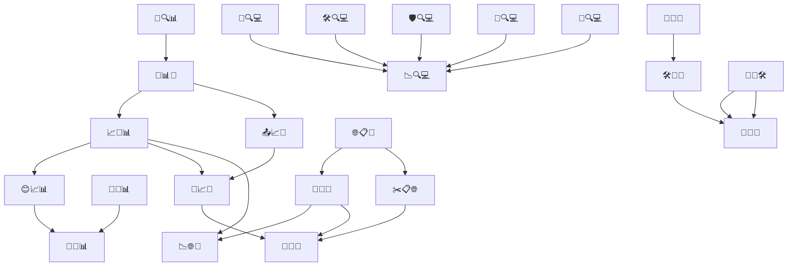

# 📋 Project Task Breakdown & Meta-Workflow

---

## 🧭 Meta-Workflow Steps (What we just did!)

1. **📦 Initial Task Graph Review**  
   - Summarized all tasks, dependencies, and groups from the codebase and context.
2. **📝 Emoji-Based Task Table Creation**  
   - Mapped emoji codes to task names, groups, statuses, and priorities for visual clarity.
3. **🔗 Group & Dependency Analysis**  
   - Provided a summary by group, cluster, and priority, identifying critical paths and parallelizable work.
4. **📊 Recommendations & Next Steps**  
   - Suggested execution order, parallel work, and cluster focus for efficient progress.
5. **📜 Collapsible Markdown & Mermaid Graph Offer**  
   - Offered Markdown with collapsible details and Mermaid dependency graph for docs or visualization.
6. **🗨️ Feedback & Iteration**  
   - Integrated user feedback, clarified task clusters, and confirmed understanding of project structure.
7. **📚 Meta-Documentation**  
   - Captured our own workflow as meta-tasks to ensure process transparency and reproducibility.

---

## 🔍 Summary by Group

📊 Data Analysis & Processing

| Task        | Description                                         | Deps         | Priority |
|-------------|-----------------------------------------------------|--------------|----------|
| 📜🔍📊        | Initial data inspection                             | —            | ⭐        |
| 📑📊🔗        | Enriched metadata linkages                          | 📜🔍📊        | ⭐        |
| 📐🔄📊        | Transformations/normalizations                      | —            | 🔄        |
| 🛠️🌐📊        | Web-integrated data tools                           | —            | 🔄        |
| 🤝📐📊        | Harmonization/synthesis                             | 😊📈📊, 📐🔄📊 | ⭐        |

📈 Metrics & Reporting

| Task        | Description                                         | Deps         | Priority |
|-------------|-----------------------------------------------------|--------------|----------|
| 📈🔗📊        | Link analysis reporting                             | 📑📊🔗        | ⭐        |
| 😊📈📊        | Sentiment/statistics                                | 📈🔗📊        | ⭐        |
| 📤📈📑        | Export of stats                                     | 📑📊🔗        | 🔄        |
| 🧠📈🔗        | AI model integration                                | 📈🔗📊, 📤📈📑 | 🔄        |

🌐 Web Module Integration

| Task        | Description                                         | Deps         | Priority |
|-------------|-----------------------------------------------------|--------------|----------|
| 🌐📋🔢        | Raw web data collection                             | —            | 🔄        |
| 🔢🔄🌐        | Conversion logic                                    | 🌐📋🔢        | 🔄        |
| ✂️📋🌐        | Pruning/filtering web data                          | 🌐📋🔢        | 🔄        |
| 📉🌐🔗        | Analytics+linkage                                   | 🔢🔄🌐, 📈🔗📊 | 🔄        |
| 🧠🌐🤝        | Smart integration                                   | 🔢🔄🌐, ✂️📋🌐, 🧠📈🔗 | 🔄        |

🔍 Local Code & Analysis

| Task        | Description                                         | Deps         | Priority |
|-------------|-----------------------------------------------------|--------------|----------|
| 🚩🔍💻        | Codebase flag scan                                  | —            | 🔄        |
| 🛠️🔍💻        | Code instrumentation                                | —            | 🔄        |
| 🛡️🔍💻        | Security analysis                                   | —            | 🔄        |
| 🔄🔍💻        | Change tracking                                     | —            | 🔄        |
| 📏🔍💻        | Metrics validation                                  | —            | 🔄        |
| 📉🔍💻        | Report synthesis                                    | 🚩🔍💻, 🛠️🔍💻, 🛡️🔍💻, 🔄🔍💻, 📏🔍💻 | 🔄        |

🔬 Research/Inference Module

| Task        | Description                                         | Deps         | Priority |
|-------------|-----------------------------------------------------|--------------|----------|
| 🔎🌐🔬        | Web-based inference engine                          | —            | 🔄        |
| 🛠️🔎🌐        | Tuning/config                                       | 🔎🌐🔬        | 🔄        |
| 📂🔬🛠️        | Internal tooling                                    | —            | 🔄        |
| 🤝📂🌐        | Interop layer                                       | 🛠️🔎🌐, 📂🔬🛠️ | 🔄        |

---

## 🗺️ Visual: Mermaid Dependency Graph

---

## ⭐ Priorities and Critical Path

- Foundation: 📜🔍📊 → 📑📊🔗 → 📈🔗📊 → 😊📈📊 → 🤝📐📊
- Parallelizable clusters: 🌐📋🔢, 🔎🌐🔬, 🚩🔍💻, and all 🔄-marked technical tasks.

---

> _Meta-note: This task breakdown now includes our recent project planning steps, so your workflow is fully traceable and reproducible!_