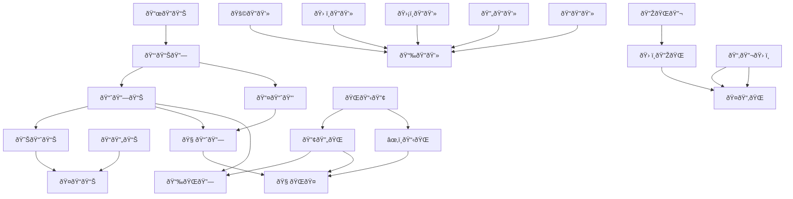

```mermaid
graph TD
  A[📜ðŸ”📊] --> B[📑📊🔗]
  B --> C[📈🔗📊]
  C --> D[😊📈📊]
  D --> E[ðŸ¤ðŸ“📊]
  F[ðŸ“🔄📊] --> E
  B --> G[📤📈📑]
  C --> H[🧠📈🔗]
  G --> H
  I[ðŸŒðŸ“‹ðŸ”¢] --> J[🔢🔄ðŸŒ]
  I --> K[✂ï¸ðŸ“‹ðŸŒ]
  J --> L[📉ðŸŒðŸ”—]
  C --> L
  J --> M[🧠ðŸŒðŸ¤]
  K --> M
  H --> M
  N[🚩ðŸ”💻] --> O[📉ðŸ”💻]
  P[🛠ï¸ðŸ”💻] --> O
  Q[🛡ï¸ðŸ”💻] --> O
  R[🔄ðŸ”💻] --> O
  S[ðŸ“ðŸ”💻] --> O
  T[🔎ðŸŒðŸ”¬] --> U[🛠ï¸ðŸ”ŽðŸŒ]
  V[📂🔬🛠ï¸] --> W[ðŸ¤ðŸ“‚ðŸŒ]
  U --> W
  V --> W
```