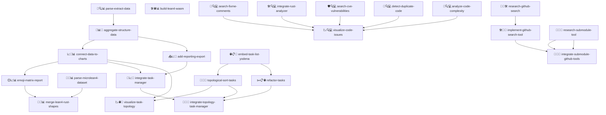

```mermaid
graph TD
  A[📜🔍📊 parse-extract-data] --> B[📑📊🔗 aggregate-structure-data]
  B --> C[📈🔗📊 connect-data-to-charts]
  C --> D[😊📈📊 emoji-matrix-report]
  D --> E[🤝📐📊 merge-lean4-rust-shapes]
  F[📐🔄📊 parse-microlean4-dataset] --> E
  B --> G[📤📈📑 add-reporting-export]
  G --> H[🧠📈🔗 integrate-task-manager]
  C --> H
  I[🛠️🌐📊 build-lean4-wasm]
  J[🌐📋🔢 embed-task-list-yodena] --> K[🔢🔄🌐 topological-sort-tasks]
  K --> L[📉🌐🔗 visualize-task-topology]
  C --> L
  J --> M[✂️📋🌐 refactor-tasks]
  K --> N[🧠🌐🤝 integrate-topology-task-manager]
  M --> N
  H --> N
  O[🚩🔍💻 search-fixme-comments] --> P[📉🔍💻 visualize-code-issues]
  Q[🛠️🔍💻 integrate-rust-analyzer] --> P
  R[🛡️🔍💻 search-cve-vulnerabilities] --> P
  S[🔄🔍💻 detect-duplicate-code] --> P
  T[📏🔍💻 analyze-code-complexity] --> P
  U[📂🔬🛠️ research-github-search] --> V[🛠️🔎🌐 implement-github-search-tool]
  W[🔎🌐🔬 research-submodule-tool] --> X[🤝📂🌐 integrate-submodule-github-tools]
  V --> X
  W --> X
```